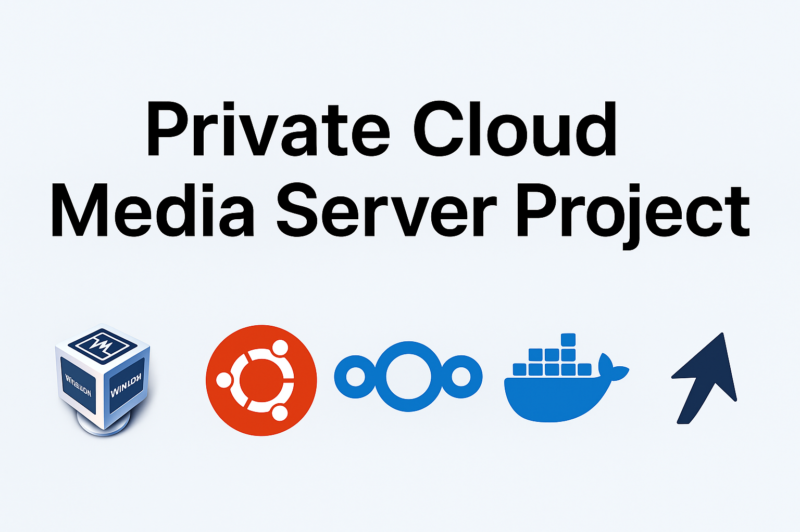
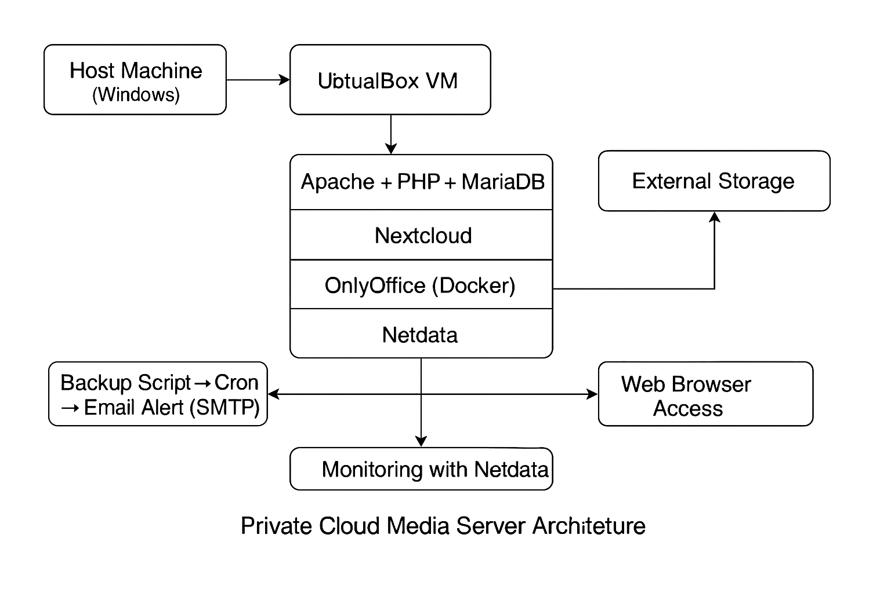

# 🖥️ Private Cloud Media Server Project – Advanced Implementation & System Administration

## 📌 Overview
This project demonstrates the deployment of a **private cloud media server** using **VirtualBox**, **Ubuntu Server 22.04**, and **Nextcloud**.  
It simulates **real-world enterprise IT operations** with secure file sharing, collaboration, monitoring, and automated backups.

📄 **[Full Project Report (PDF)](Private%20Cloud%20Media%20Server%20Project%20V1.pdf)**  
*(Or download directly [here](https://github.com/hamzahssaini/private-cloud-media-server/raw/main/Private%20Cloud%20Media%20Server%20Project%20V1.pdf))*

---

## 🚀 Key Features
- **Secure HTTPS** with self-signed SSL certificates
- **Automated Backups** with email alerts via Gmail SMTP
- **Real-time Document Editing** with OnlyOffice integration
- **External Storage Integration** for scalability
- **Live Monitoring** with Netdata & system logs
- **Role-based User Access Control** for enterprise-like security

---

## 🛠️ Technologies Used
| Category              | Technologies |
|-----------------------|--------------|
| Virtualization        | VirtualBox |
| OS                    | Ubuntu Server 22.04 |
| Web Server            | Apache |
| Database              | MariaDB |
| Cloud Storage         | Nextcloud |
| Collaboration Suite   | OnlyOffice (Docker) |
| Monitoring            | Netdata, htop |
| Automation            | Bash, Cron |
| Security              | SSL/TLS, SMTP |

---
## 📷 Screenshots

### 1. System Architecture

## 🎯 Skills Demonstrated
- Linux Server Administration
- Docker & Containerization
- Network Configuration & SSL/TLS Security
- Backup Automation & Scripting
- Enterprise-style User Management
- Troubleshooting Apache, DNS, and SSL issues

---

## 📬 Contact
**Hamza Hssaini**  
🌐 [LinkedIn](https://www.linkedin.com/in/hamza-hssaini)  
📧 hamzahssaini0@gmail.com

---

> 💡 This project reflects real-world system administration and DevOps tasks, simulating the environment of enterprise IT infrastructure.
